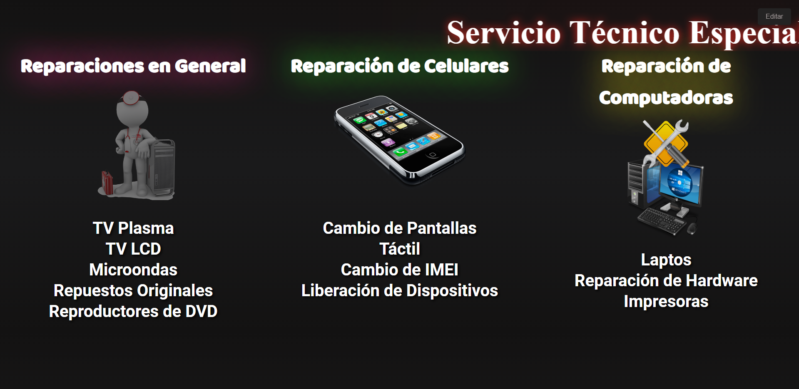
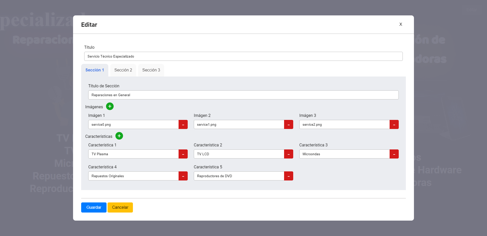

# Publicidad de Reparaciones

Desarrollado con [vue.js](https://vuejs.org/), con persistencia de datos en el localStorage.

## Uso

### localStorage

Al iniciar la aplicación en el navegador se agrega al localStorage datos por defecto:

```js
// variable usada en toda la aplicación
let myLocalStorage = localStorage;

let setMyLocalStorageDefault = () => {
  if (!myLocalStorage.getItem("advertisement")) {
    myLocalStorage.setItem(
      "advertisement",
      JSON.stringify({
        title: "Servicio Técnico Especializado",
        sections: [
          {
            id: 1,
            title: "Reparaciones en General",
            images: [
              { id: 1, src: "service0.png" },
              { id: 2, src: "service1.png" },
              { id: 3, src: "service2.png" }
            ],
            features: [
              { id: 1, text: "TV Plasma" },
              { id: 2, text: "TV LCD" },
              { id: 3, text: "Microondas" },
              { id: 4, text: "Repuestos Originales" },
              { id: 5, text: "Reproductores de DVD" }
            ]
          },
          // Agregar más secciones (recomendado 3)
          ...
        ]
      })
    );
  }
};

setMyLocalStorageDefault();
```

Pueden ser la cantidad de secciones que desee, pero se recomienda 3.

### Imágenes

Se deben guardar en la carpeta [assets](assets/). Se recomienda imágenes con fondo transparente (.png).

## Capturas



